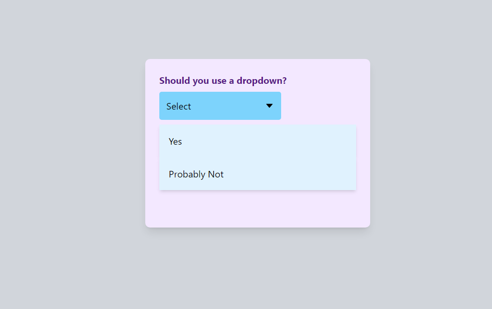

# Dropdown Component in React

This is a simple dropdown component built using ReactJS.

## Getting Started

These instructions will get you a copy of the project up and running on your local machine for development and testing purposes.

### Prerequisites
- Node.js
- NPM or Yarn

### Installing
1. Clone the repository to your local machine
2. Navigate to the project directory
3. Run `npm install` or `yarn install` to install the dependencies
4. Run `npm start` or `yarn start` to start the development server

## Components
The project consists of two components:
- DropdownButton
- OptionsList

## Code Example
Here is an example of how to use the Dropdown component:

```javascript
import React from "react";
import Dropdown from "./Dropdown";

function App() {
  return (
    <div className="container mx-auto p-5">
      <Dropdown />
    </div>
  );
}
```

export default App;

## Built With
- ReactJS
- Create React App

##Screenshot


## Author
[Vikram](https://github.com/vikramkbgs)

